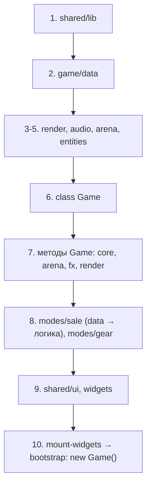

# Архитектура

Карта проекта: что где лежит, почему именно так и как добавлять новое, ничего не сломав.
Короткая выжимка правил — в [AGENTS.md](../AGENTS.md).

## Главное ограничение

Сборщика нет. `index.html` перечисляет 127 обычных `<script src>` и 21 `<link>`, браузер
выполняет их строго по порядку, GitHub Pages раздаёт файлы как есть. Отсюда два следствия, которые
определяют всю структуру:

1. **Общая область видимости.** Верхнеуровневые `const`, `class` и `function` из одного
   файла видны всем следующим. Это заменяет импорты: `spawn.js` просто пишет
   `saleMaxEnemiesForTime(...)`, не объявляя зависимость.
2. **Порядок = зависимости.** Раз импортов нет, единственный способ выразить «А нужен до Б» —
   поставить А выше в `index.html`.

Плюс подхода: ноль конфигурации, правка файла сразу видна после F5. Минус: компилятор
не проверит за тебя ни имена, ни порядок — это делают скрипты в `tools/`.

## Дерево

```
index.html                 корни виджетов + порядок подключения (241 строка)
manifest.webmanifest       PWA-манифест
sw.js                      service worker, список прекеша генерируется

assets/                    atlases/ icons/ gear/ app-icons/ images/

src/
  app/                     точка входа
    telegram.js            инициализация Telegram Mini App (грузится в <head>)
    mount-widgets.js       вставка разметки виджетов в пустые корни
    bootstrap.js           перехват падений, регистрация SW, new Game()

  shared/                  ничего не знает об игре
    lib/                   math.js (rand, dist, angleTo), storage.js, env.js
    ui/                    button/, battle-bar/, overlay/ — UI-кит
    styles/                tokens.css, base.css, utilities.css, body-state.css

  game/
    core/                  game.js (конструктор + loop) и методы по зонам:
                           input, camera, save, run, rewards, loadout,
                           overlays, feedback, bind-ui, update, canvas
    render/                draw-atlas-frame.js, background, depth-sort,
                           lighting, frame + atlases/ (загрузка 13 атласов)
    entities/              player, enemy, projectile, pickup, particle, speech-bubble
    arena/                 bounds, theme, fence, zones, obstacles, decor
    fx/                    particles, sprite-fx, explosions, boss-line-attack
    audio/                 sfx.js, music.js
    data/                  таблицы баланса + atlas-frames/ (координаты кадров)
    modes/
      sale/                режим «Распродажа» — основной
        data/              14 таблиц: config, heroes, bosses, weapons,
                           passives, evolutions, floors, contracts, synergies,
                           hub-shop, events, powerups, roles, overflow
        run.js             старт забега, герой, этаж, контракт, множители
        spawn.js           спавн рядовых
        director.js        расписание: боссы, волны, элиты
        boss-ai.js         поведение боссов
        combat.js          нанесение урона, поиск цели
        weapons.js         логика всех типов оружия
        loot.js            XP, пауэрапы, сердца, цифры урона
        progression.js     убийства, набор опыта
        level-up.js        экран уровня, баниш, применение выбора
        events.js          минутные события ТЦ
        update.js          главный тик режима
        hud.js             боевой HUD
        render.js          отрисовка мира и экранного слоя
        end.js             итоги забега
        hub.js             витрина хаба
        curves.js          кривые сложности и спавна
        icons.js           emoji-иконки оружия
        hooks.js           перехваты базовых методов Game
        telemetry.js       дев-логи баланса
        dev-panel.js       дев-панель и window.__sale
      gear/                мета-экипировка: data, state, economy, hub-ui

  widgets/                 самостоятельные куски UI

tools/                     проверки (.mjs) и генераторы ассетов (.py)
docs/                      ARCHITECTURE, ROADMAP, TELEGRAM, ATTRIBUTION
reference/                 чужой проект для сверки, в сборку не входит
```

## Порядок загрузки



Внутри яруса порядок обычно свободен: файлы объявляют функции и дописывают прототип,
но ничего не выполняют. Исключения — те, кто читает данные прямо на загрузке.

Тонкость: `const` попадает в глобальную лексическую область и до выполнения своего файла
находится в TDZ. Обращение к нему из более раннего скрипта **на этапе загрузки** бросит
`ReferenceError`, даже под `typeof`. Внутри функций, которые вызываются после загрузки
страницы, это неважно — поэтому `game.js` спокойно читает `SALE_WEAPON_MIGRATE`,
объявленный ниже по списку.

## Паттерн 1. Данные отдельно от логики

Таблицы вынесены в `data/`, чтобы правка баланса не требовала чтения кода. Файл содержит
только константы и, максимум, чистый хелпер над ними.

```js
/**
 * Распродажа: Этажи ТЦ — ранний пул оружия и бонус этажа.
 */
'use strict';

const SALE_FLOORS = [
  { id: 'grocery', name: 'Продукты', ico: '🛒', weapons: ['coffee', 'receipt'] },
];
```

## Паттерн 2. `class Game` разрезан по прототипу

`Game` — большой объект состояния забега. Класс нельзя физически разложить по файлам,
поэтому `core/game.js` держит только конструктор и `loop`, а остальные методы
дописываются снаружи:

```js
/** Камера: размер вьюпорта и перевод экранных координат в мировые. */
'use strict';

Object.assign(Game.prototype, {
  viewW() { return this.W / (this.viewZoom || 1); },
  screenToWorld(sx, sy) { /* ... */ },
});
```

Один файл — одна зона ответственности. Режимы (`modes/sale`, `modes/gear`) используют
тот же приём и вдобавок перехватывают базовые методы:

```js
// modes/sale/hooks.js
const saleBaseResize = Game.prototype.resize;
Game.prototype.resize = function () {
  saleBaseResize.call(this);
  /* поправка мира под режим */
};
```

Имя сохранённого метода обязательно с префиксом режима: это глобальное имя,
короткое `_resize` рано или поздно с чем-нибудь столкнётся.

## Паттерн 3. Виджеты

`index.html` держит только пустые корни. Разметку вставляют сами виджеты:

```html
<div class="overlay" id="settings-overlay"></div>
```

```js
// src/widgets/settings-popup/settings-popup.js
(function (global) {
  'use strict';

  const TEMPLATE = `<div class="panel">…</div>`;

  global.SettingsPopup = {
    mount(root) { root.innerHTML = TEMPLATE; },
  };
})(typeof window !== 'undefined' ? window : globalThis);
```

```js
// src/app/mount-widgets.js
mountWidget('settings-overlay', SettingsPopup);
```

Связка с игрой живёт отдельно, в `<виджет>.bindings.js`, и общается с виджетом через
его публичные методы. Так вёрстку можно менять, не задевая игровую логику, и наоборот.

`mount-widgets.js` выполняется до `bootstrap.js`, потому что конструктор `Game` кэширует
DOM-узлы (`this.$hpFill = document.getElementById(...)`) — к этому моменту разметка
должна существовать.

Готовые кнопки берутся из UI-кита: `UiButton.create({ text, variant, size, onClick })`.
Свою систему кнопок заводить не нужно, `.button` — единственная.

## Стили

- `tokens.css` — палитра и общие переменные в `:root`.
- `base.css` — сброс, разметка страницы, канвас.
- `utilities.css` — мелкие раскладочные классы.
- `shared/ui/*/*.css` — UI-кит, у каждого свой префикс переменных (`--button-`, `--bb-`).
- `widgets/*/*.css` — стили конкретного экрана.
- `body-state.css` — перекрытия по состоянию приложения (`body.sale-mode`, `body.dev-env`),
  подключается последним, чтобы выигрывать по каскаду.

## Service worker и кэш

`sw.js` держит app shell для офлайна. Два важных момента:

- **Список прекеша генерируется** `tools/sync-sw-precache.mjs` из подключений `index.html`
  и содержимого `assets/`. Имя кэша — хеш содержимого, поэтому любая правка сама
  инвалидирует старый кэш. Один 404 в списке ломает установку SW целиком.
- **`.js` и `.css` отдаются network-first.** Код разложен на десятки мелких файлов,
  и одного залипшего в кэше хватило бы, чтобы собрать нерабочую смесь старой и новой сборки.
  Картинки остаются cache-first.

## Инструменты

| Скрипт | Что делает |
|---|---|
| `tools/check-integrity.mjs` | все пути из `index.html` и JS существуют, каждый файл парсится, нет дублей глобальных имён, `sw.js` не устарел |
| `tools/smoke.mjs` | грузит страницу в jsdom со всеми скриптами, проверяет что виджеты собрали разметку, прогоняет 15 сценариев |
| `tools/sync-sw-precache.mjs` | пересобирает список прекеша и версию кэша |
| `tools/assets/*.py` | генераторы атласов, запускаются вручную при правке артов |

Чего проверки **не** ловят: визуальные регрессии, реальный тач-ввод, поведение SW
в браузере. Это по-прежнему смотрят глазами через `npx serve .`.

## Деплой

`.github/workflows/pages.yml` собирает сайт из двух веток без шага сборки:
`main` → корень, `dev` → `/dev/`. Просто `rsync`, новые папки подхватываются сами.

- прод: https://rozhokserega-lang.github.io/consultant-game/
- дев: https://rozhokserega-lang.github.io/consultant-game/dev/

`isDevEnvironment()` включает дев-режим на localhost, на пути `/dev/` и по `?dev=1`.
В дев-режиме доступна панель по клику на версию и API `window.__sale`.

## Рецепты

### Добавить оружие

1. Описание в `src/game/modes/sale/data/weapons.js` (id, name, ico, type, урон по уровням).
2. Если поведение нестандартное — ветка в `src/game/modes/sale/weapons.js`.
3. Цену в хабе — в `data/hub-shop.js`, эволюцию — в `data/evolutions.js`.
4. Новых файлов нет, значит `index.html` не трогаем. Прогнать проверки.

### Добавить экран

1. Папка `src/widgets/<имя>/` с тремя файлами по паттерну 3.
2. Пустой корень в `index.html` + `<link>` на css + два `<script>` в ярусе 9.
3. Строка в `src/app/mount-widgets.js`.
4. `node tools/sync-sw-precache.mjs`, затем проверки.

### Добавить метод Game

1. Найти файл своей зоны (`core/input.js`, `modes/sale/loot.js`, …). Новый файл заводить,
   только если зона новая или существующий файл уже слишком большой.
2. Новый файл — подключить в правильном ярусе, обязательно после `core/game.js`.

### Разрезать разросшийся файл

1. Разложить по зонам ответственности, сохранив порядок объявлений.
2. Каждый кусок — плоский файл с шапкой и `'use strict';`.
3. Подключить все части подряд в том же месте `index.html`.
4. `check-integrity.mjs` проверит дубли имён, `smoke.mjs` — что ничего не отвалилось.
